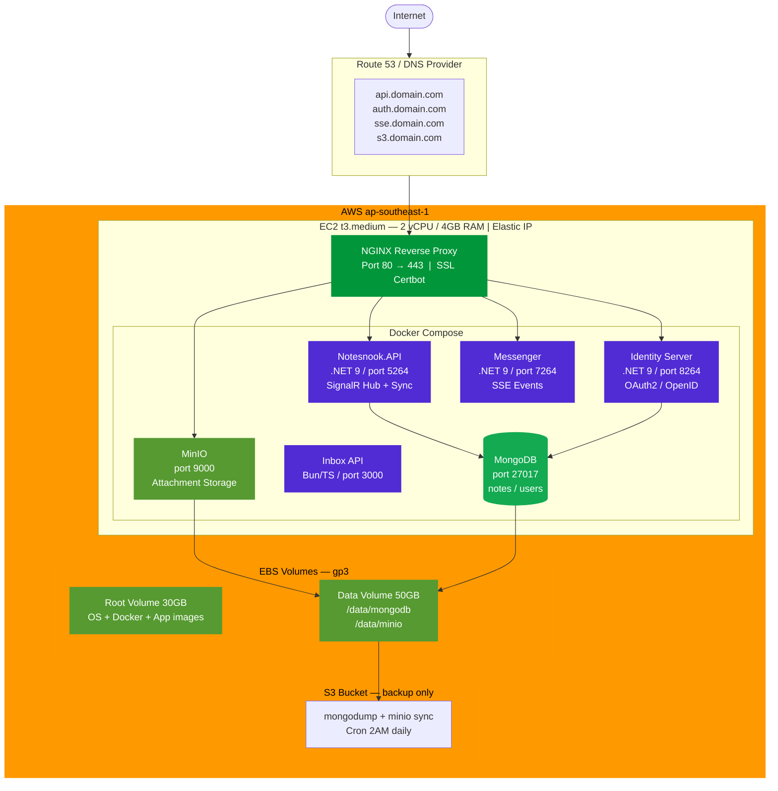
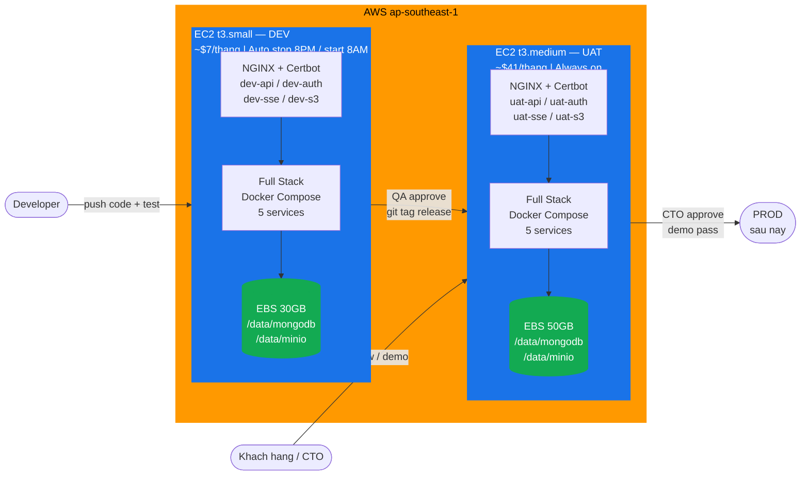
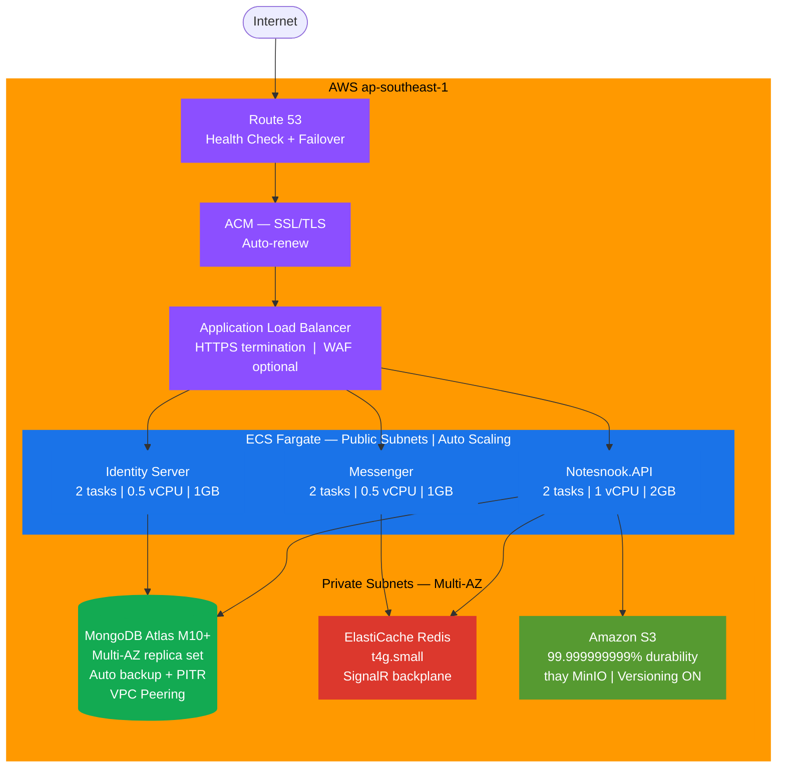
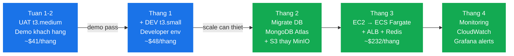

# Architecture Diagrams (Mermaid) — Notesnook Sync Server on AWS

> Paste từng block vào [mermaid.live](https://mermaid.live) để xem và lấy shareable link.

---

## Diagram 1: EC2 t3.medium — Single Instance (Demo/UAT)

**Chi phí:** EC2 ~$35 + EBS ~$6.40 + S3 backup ~$0.23 ≈ **$42/tháng**

---

## Diagram 2: DEV + UAT (2 EC2 riêng)

**Chi phí:** DEV ~$7 + UAT ~$41 = **~$48/tháng**

---

## Diagram 3: Enterprise (Production Grade)

**Chi phí:** ~$232/tháng (giảm ~20% với Savings Plans 1 năm)

---

## Diagram 4: Migration Path

---

## So sánh 3 môi trường

```mermaid
graph LR
    subgraph DEV["DEV — t3.small\n~$7/thang"]
        d1["2 vCPU / 2GB RAM"]
        d2["EBS 30GB"]
        d3["MongoDB Docker"]
        d4["Certbot SSL"]
        d5["8AM-8PM weekdays"]
    end

    subgraph UAT["UAT / Demo — t3.medium\n~$41/thang"]
        u1["2 vCPU / 4GB RAM"]
        u2["EBS 50GB"]
        u3["MongoDB Docker"]
        u4["Certbot SSL"]
        u5["Always on"]
    end

    subgraph PROD["PROD — ECS Fargate\n~$232/thang"]
        p1["4.5GB total tasks"]
        p2["Amazon S3"]
        p3["MongoDB Atlas M10+"]
        p4["ACM auto-renew"]
        p5["24/7 + autoscaling"]
    end

    DEV -->|"promote"| UAT
    UAT -->|"go live"| PROD
```

